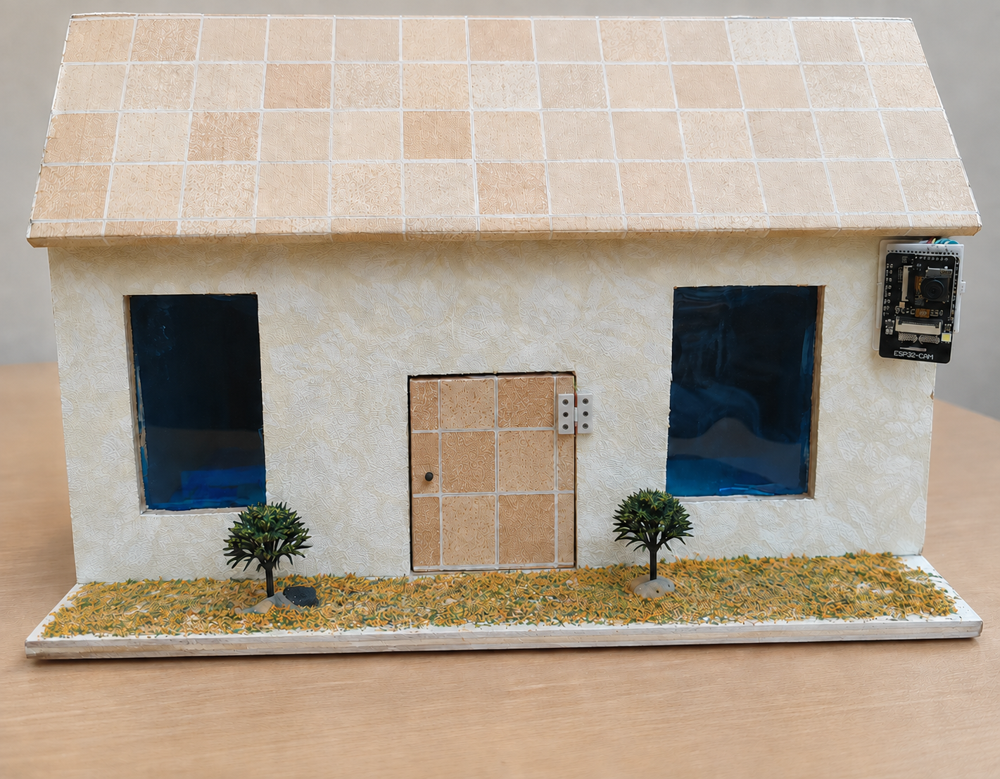
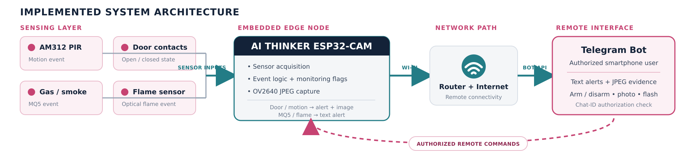

# ESP32-CAM Smart Home Security System

An embedded security demonstrator built around an AI Thinker ESP32-CAM,
OV2640 camera, intrusion sensors, and environmental-safety sensors. The
physical model home was used to integrate and qualitatively test motion, door,
flame, and gas/smoke event paths.



## Project scope

The implemented prototype combined:

- Two magnetic contacts for door-state monitoring.
- An AM312 PIR sensor for motion detection.
- An MQ5 module for gas/smoke sensing.
- An optical flame-detector module.
- An OV2640 camera for intrusion-event images and requested photographs.
- An AI Thinker ESP32-CAM as the sensing, decision, imaging, and communication
  node.

The original demonstrator used a Telegram bot for remote arming, text alerts,
and JPEG delivery. The public firmware in this repository deliberately removes
the network and messaging layer. It replaces remote commands with a local
Serial interface and contains no Wi-Fi credentials, bot token, chat ID, or
private endpoint configuration.

## Original implemented architecture



The architecture diagram documents the physically demonstrated project. The
firmware published here is a credential-free local refactor of the embedded
sensor and camera layer; it does not implement the Telegram path shown above.

## Engineering contribution

- Assembled the ESP32-CAM, PIR sensor, magnetic contacts, flame detector, MQ5
  module, level-shifting interface, and prototype power distribution.
- Configured the OV2640 camera and implemented event-specific sensor handling.
- Integrated the electronics and routed the sensor wiring inside a physical
  model home.
- Adapted the planned gas sensor from MQ6 to MQ5 when the original component
  was unavailable.
- Performed qualitative scenario-based testing of door, motion, flame, and
  gas/smoke events.
- Refactored the documented firmware to remove embedded secrets and correct
  state-handling, threshold, and interrupt-related defects.

## Hardware map

| Function | Component | ESP32-CAM pin | Active condition |
| --- | --- | ---: | --- |
| Camera | OV2640 | AI Thinker camera bus | JPEG frame capture |
| Motion | AM312 PIR | GPIO 13 | HIGH |
| Door 1 | Magnetic contact | GPIO 12 | LOW |
| Door 2 | Magnetic contact | GPIO 2 | LOW |
| Flame | Optical flame module | GPIO 14 | LOW |
| Gas/smoke | MQ5 analog output | GPIO 15 | Adjustable ADC threshold |
| Camera flash | On-board LED | GPIO 4 | HIGH |

> [!CAUTION]
> ESP32 inputs are not 5 V tolerant. The MQ5 analog output must be limited to
> 3.3 V using the prototype's divider or level-shifting circuit. GPIO 2, 12,
> and 15 are ESP32 boot-strapping pins, so the external circuitry must not
> force an invalid level during reset.

## Public firmware

The sketch is located at
[`firmware/smart_home_security_local/smart_home_security_local.ino`](firmware/smart_home_security_local/smart_home_security_local.ino).

It provides:

- Debounced, edge-triggered digital sensor events.
- MQ5 sampling with smoothing, an adjustable threshold, and hysteresis.
- A 40-second prototype warm-up delay for PIR and MQ5 monitoring.
- Independent arming and disarming of each monitoring channel.
- OV2640 JPEG capture verification in RAM.
- Local event and diagnostic output through the Serial Monitor.
- Rollover-safe timing based on `millis()`.

Captured frames are released after their dimensions and byte count are
reported. They are not transmitted or saved by this local firmware.

### Serial commands

Open the Arduino Serial Monitor at **115200 baud** and select a newline ending.

```text
status
photo
flash on
flash off
arm all
arm doors
arm motion
arm flame
arm gas
disarm all
disarm doors
disarm motion
disarm flame
disarm gas
gas-threshold <30..4095>
help
```

The initial MQ5 threshold is `400` ADC counts because that was the value used
by the documented prototype. It must be recalibrated for the actual sensor,
power supply, voltage divider, clean-air baseline, and installation.

## Build and upload

1. Install Arduino IDE and the Espressif ESP32 board package.
2. Open `smart_home_security_local.ino`.
3. Select **AI Thinker ESP32-CAM** as the board.
4. Enable PSRAM and select an upload speed supported by the USB-to-serial
   adapter.
5. Connect GPIO 0 to GND while uploading, then disconnect GPIO 0 from GND and
   reset the board to run the sketch.
6. Power the module from a stable 5 V supply. Do not suppress brownout
   detection to hide an inadequate supply.

The camera configuration follows Espressif's current AI Thinker pin map and
uses JPEG with one frame buffer. With PSRAM, the sketch selects SVGA; without
PSRAM, it falls back to CIF to reduce memory demand.

## Validation status

The original model-home prototype was physically assembled and tested using
qualitative event scenarios. The available documentation reports Telegram
alerts for MQ5 and flame events and alerts with images for PIR and door events.

The public local firmware has been rewritten and subjected to strict C++ syntax
checking, but it has not yet been uploaded to and revalidated on the original
physical prototype. Sensor polarity, MQ5 threshold, power integrity, and the
boot behavior of the strapping pins must therefore be confirmed on hardware.

No quantitative latency, false-alarm-rate, calibration, endurance, or power
measurements were available for the original implementation.

## Project evidence

| Evidence | File |
| --- | --- |
| Exterior prototype | [`docs/images/model-home-exterior.png`](docs/images/model-home-exterior.png) |
| Interior wiring | [`docs/images/model-home-interior.png`](docs/images/model-home-interior.png) |
| Telegram photo demonstration | [`docs/images/telegram-photo-demo.png`](docs/images/telegram-photo-demo.png) |
| Architecture source | [`docs/architecture/system-architecture.svg`](docs/architecture/system-architecture.svg) |
| Two-page portfolio case study | [`docs/portfolio/project-portfolio.pdf`](docs/portfolio/project-portfolio.pdf) |

## Repository structure

- `firmware/` - credential-free ESP32-CAM Arduino firmware.
- `docs/architecture/` - system architecture in PNG and editable SVG formats.
- `docs/images/` - photographs and demonstration evidence.
- `docs/portfolio/` - recruiter-facing PDF case study.

## Limitations and next steps

- The published firmware has no remote connectivity or persistent photo
  storage.
- MQ5 readings are prototype ADC counts, not calibrated gas concentrations.
- The shared ESP32-CAM I/O and boot-strapping pins constrain further expansion.
- A production-oriented revision should add local alarms, backup power,
  watchdog recovery, event logging, sensor diagnostics, secure credential
  provisioning, signed firmware updates, and quantitative validation.

Gas and flame decisions should remain deterministic and local. Any future
vision intelligence should be limited to visual verification and must not
become a dependency for safety-critical detection.

## Reference basis

The original wiring and firmware baseline was adapted from the
[make2explore ESP32-CAM and Telegram reference design](https://www.hackster.io/make2explore/home-security-system-using-esp32-cam-and-telegram-app-dce4f8).
This repository distinguishes that baseline from the team-based physical
integration, component adaptation, testing, and subsequent firmware refactor.

## Author

**Tinhinene Boumerdassi** - Embedded Systems & Robotics Engineer

[Portfolio](https://tina-boumerdassi-portfolio.framer.website/)
